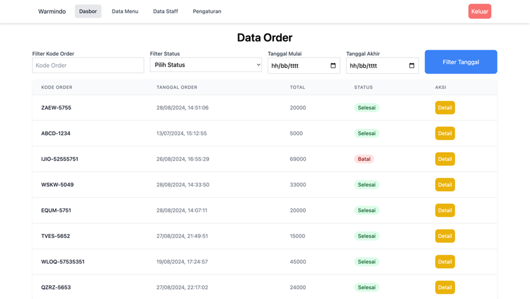
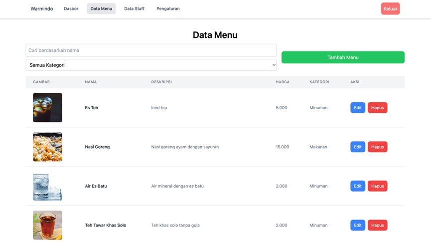
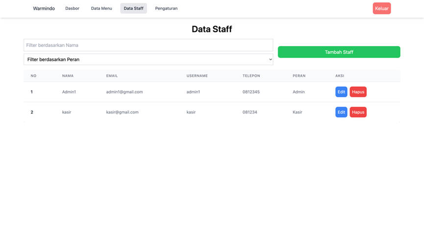
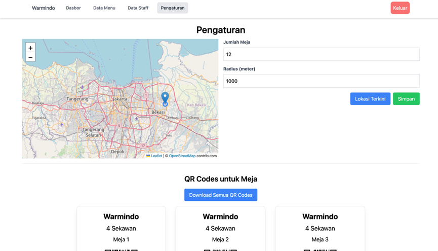
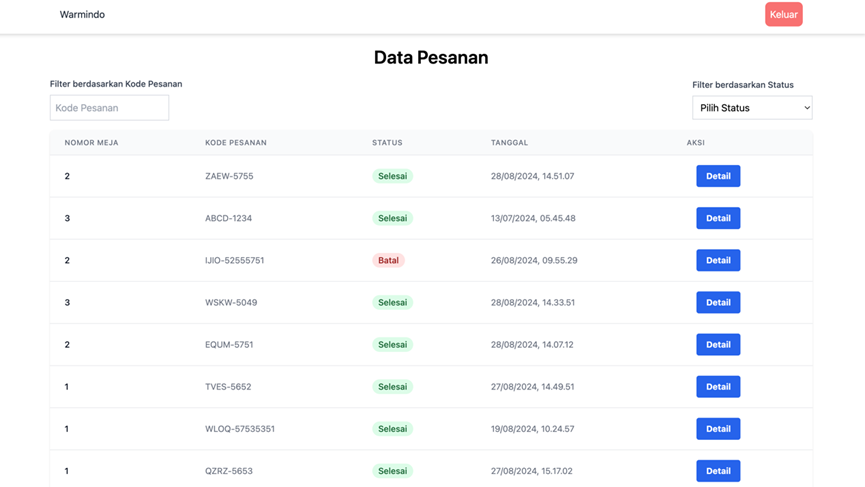
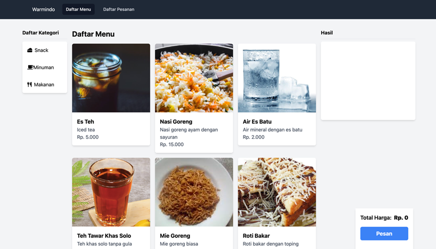
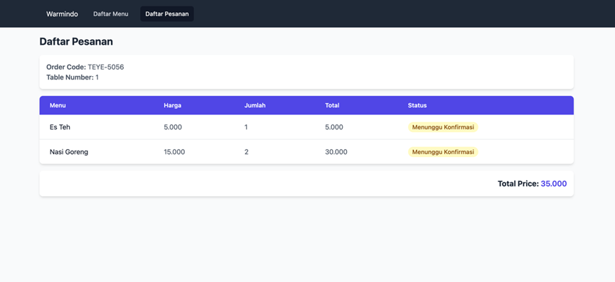

# 🍜 Website Pemesanan Warmindo

Website pemesanan **Warmindo** dirancang untuk memudahkan proses pemesanan makanan dan minuman secara digital.  
Terdapat tiga jenis peran (role) pengguna dalam sistem ini:

- **Admin**
- **Kasir**
- **Pelanggan**

---

## 🚀 Pendahuluan
Website ini memiliki tiga akses login utama:
- Admin (pengelola sistem)
- Kasir (pengelola pesanan)
- Pelanggan (pemesan melalui QR Code)

---

## 👨‍💼 Role: Admin

### 🔑 Akses Login Admin
- **Email**: `admin1@gmail.com`  
- **Password**: `admin1`

### 📌 Halaman Admin
Admin memiliki akses ke **4 halaman utama**:

#### 1. Halaman Dasbor
- Melihat data pesanan.
- Filter data berdasarkan:
  - Kode order
  - Status pesanan
  - Tanggal pesanan  

#### 2. Halaman Data Menu
- Melihat daftar menu.
- Menambah, mengubah, menghapus menu.
- Filter data berdasarkan:
  - Nama menu
  - Kategori menu  

#### 3. Halaman Data Staff
- Melihat daftar staff.
- Menambah, mengubah, menghapus staff.
- Filter data berdasarkan:
  - Nama staff
  - Role staff  

#### 4. Halaman Pengaturan
- Mengatur jumlah meja.
- Menentukan lokasi & radius layanan.
- Setiap meja memiliki QR Code yang dapat diunduh untuk pelanggan.  

---

## 💁 Role: Kasir

### 🔑 Akses Login Kasir
- **Email**: `kasir@gmail.com`  
- **Password**: `kasir`

### 📌 Halaman Kasir
Kasir memiliki akses ke **1 halaman utama**:

#### Halaman Data Pesanan
- Mengubah status pesanan.
- Alur status pesanan:
  - **Konfirmasi**: Menunggu Konfirmasi ➔ Proses ➔ Dihidangkan ➔ Selesai
  - **Batal**: Menunggu Konfirmasi ➔ Batal  

---

## 🍴 Role: Pelanggan

### 🔑 Akses Pelanggan
- Scan QR Code yang tersedia di meja.
- Akses alamat sesuai nomor meja:  
  `https://warmindo.netlify.app/scan/{no_meja}`

### 📌 Halaman Scan Pelanggan
Sebelum memesan, sistem melakukan beberapa validasi:
1. **Kode Order & Nomor Meja**  
   - Jika ditemukan di penyimpanan lokal → langsung ke daftar menu.  
   - Jika tidak, lanjut validasi lokasi.  
2. **Lokasi**  
   - Sistem memastikan pelanggan berada dalam radius layanan.  
3. **Kode Order Aktif**  
   - Jika ada → pelanggan harus memasukkan kode order.  
   - Jika tidak ada → sistem membuat kode order baru.  

### 📌 Halaman Daftar Menu
- Menampilkan kategori & daftar menu.  
- Fitur:
  - Memilih menu.
  - Mengatur jumlah pesanan.
  - Menghapus pesanan sebelum klik tombol **Pesan**.  

### 📌 Halaman Daftar Pesanan
- Menampilkan:
  - Kode order.
  - Nomor meja.
  - Daftar pesanan yang telah dibuat.  

---

## 🛠️ Teknologi yang Digunakan
- **Frontend**: React + Tailwind CSS  
- **Backend**: Golang (Fiber)  
- **Database**: MySQL/PostgreSQL  
- **Auth**: JWT  
- **Hosting**: Netlify  

---

## 📷 Preview QR Code
Setiap meja memiliki QR Code unik yang dapat dipindai oleh pelanggan.  
Contoh:  

---
